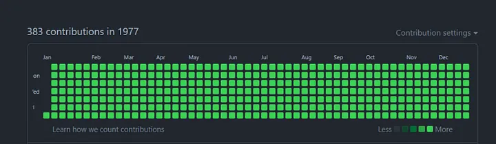

```javascript
class Bio {
  constructor() {
    this.aboutMe = {
      name: "Bishwa Jung Shah",
      description: "Self-taught Fullstack Developer, Student at Yeti International College",
      status: "Living my best life, learning Node.js, Vue.js, SQL",
      goalsFor2024: ["Enhance programming techniques", "Problem-solving", "Analytical skills"]
    };

     this.workExperience = [
      {
        role: "Intern",
        company: "Mediaholic",
        duration: "5 months",
        responsibilities: "Worked on Vue.js projects and contributed to front-end development."
      },
      {
        role: "Junior Developer",
        company: "Hyteno/Morgenland",
        duration: "8 months",
        responsibilities: "Developed web applications, improved coding skills, and worked with Vue.js."
      },
      {
        role: "Fullstack Developer",
        company: "Detech",
        duration: "Current",
        responsibilities: "Currently working as a Fullstack Developer, focusing on modern web technologies."
      }
    ];
    
    this.favorites = {
      os: "Parrot OS",
      ide: "VS Code",
      languages: ["Python", "JavaScript"],
      mobileOS: "Android",
      games: ["COC", "PUBG"],
      music: {
        genres: ["Lo-fi", "Jazz"],
        songs: ["MF DOOM - One Beer", "Quasimodo - Bad Character"],
        artists: ["Arijit Singh", "Taylor Swift", "Alan Walker"]
      }
    };
    
    this.tools = {
      frameworks: ["Nuxt", "Vue", "React", "Svelte"],
      languages: ["HTML", "CSS", "Bash", "Markdown"],
      databases: ["MongoDB", "Postgres"],
      platforms: ["GNU/Linux", "Windows"],
      otherTools: ["Git", "Figma", "Nginx", "SCSS", "TypeScript"]
    };
    
    this.randomStuff = {
      funFact: "More people are killed annually by donkeys than airplane crashes.",
      advice: "Do not compare yourself with others."
    };
    this.socialLinks = {
          instagram: "https://instagram.com/shah.bishwa77",
          linkedin: "https://linkedin.com/in/bishwa777",
          facebook: "https://facebook.com/profile.php?id=100089079516208",
          medium: "https://medium.com/@shahbishwa21",
          portfolio: "https://bishwa-shah.netlify.app/"
        };
  }

  display() {
    console.log(this);
  }
}

const bio = new Bio();
bio.display();
```

    
### ✍️ Random Dev Quote


**Code Cycle**<br>

<div align="center">
  
&nbsp;&nbsp;&nbsp;&nbsp;&nbsp;

&nbsp;&nbsp;&nbsp;&nbsp;&nbsp;
<br>

</div>

## Blog posts 🔭
<table><tr>
  <td>
    <h3> Understanding Lexical Scope and Closures in JavaScript </h3>
    <p>Lexical scope refers to how variable scope is determined by the structure of the code. A variable’s scope is defined by where it is declared, and it is accessible within that scope and any nested scopes</p>
    <a href="https://medium.com/@shahbishwa21/understanding-lexical-scope-and-closures-in-javascript-ae16b050f47c">👉🏽 Read more</a>
  </td>
  <td>
    
  </td>
</tr>

<tr>
  <td>
    <h3> Automate Daily Commits with GitHub Actions </h3>
    <p>Automating commits might seem quirky, but it’s actually pretty useful! It keeps your GitHub repo active, lets you test GitHub Actions, and adds a bit of fun. While some might say it’s cheating, I just think it’s a clever way to keep my GitHub updated — even if I’m not around (Into this world 😆).</p>
    <a href="https://medium.com/@shahbishwa21/automate-daily-commits-with-random-content-using-github-actions-804736759c1d">👉🏽 Read more</a>
  </td>
  <td>
    
  </td>
</tr>

<tr>
  <td>
    <h3> JavaScript Safe Assignment Operator (?=): A Complete Guide </h3>
    <p>JavaScript is introducing a new operator, ?=, called the Safe Assignment Operator. This operator is designed to simplify error handling in your code, making it easier and more readable, especially when dealing with functions that might fail or throw errors.</p>
    <a href="https://medium.com/@shahbishwa21/introduction-to-the-safe-assignment-operator-in-javascript-ddc35e87d37c">👉🏽 Read more</a>
  </td>
  <td>
    
  </td>
</tr>
</table>


<details>
  <summary align="center">
    <h2>Show More</h2>
  </summary>
  <table>
  <tr>
  <td>
    <h3> Tailwind CSS vs. SCSS: Which is Right for Your Project? </h3>
    <p>Tailwind CSS is a utility-first CSS framework that promotes a different approach to styling compared to traditional CSS methodologies. Instead of defining styles in a separate CSS file or in your style sheets...</p>
    <a href="https://medium.com/@shahbishwa21/tailwind-css-vs-scss-which-is-right-for-your-project-6df79da6c68a">👉🏽 Read more</a>
  </td>
  <td>
    
  </td>
</tr>

<tr>
  <td>
    <h3> Destructuring Arrays in JavaScript: A Deep Dive </h3>
    <p>Did you know how destructure works in arrays behind in JavaScript? This feature is quite powerful and can simplify how you access and work with array elements. Let’s dive into how it works.</p>
    <a href="https://medium.com/@shahbishwa21/destructuring-arrays-in-javascript-a-deep-dive-8aaa555fb71b">👉🏽 Read more</a>
  </td>
  <td>
    
  </td>
</tr>

<tr>
  <td>
    <h3> Mastering SCSS: The Correct Way to Use SCSS in Your Projects </h3>
    <p>SCSS (Sassy CSS) is a powerful extension of CSS that adds features like variables, nesting, and mixins, making your stylesheets more maintainable and modular. In this blog post ..</p>
    <a href="https://medium.com/@shahbishwa21/mastering-scss-the-correct-way-to-use-scss-in-your-projects-3a5cbc53e45b">👉🏽 Read more</a>
  </td>
  <td>
    
  </td>
</tr>
</table>

</details>

[](https://visitcount.itsvg.in)


